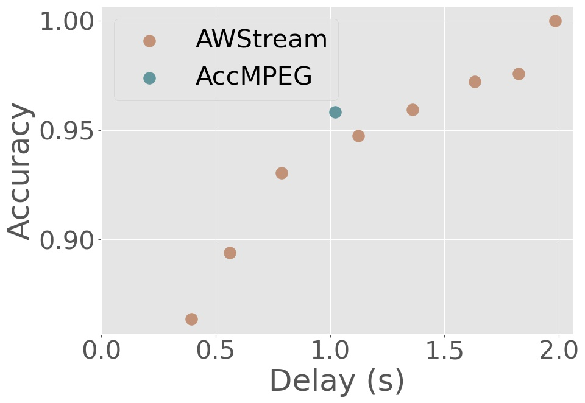

# video-compression

Here are the steps to run our code. We assume you start from a directory called $DIR, and your working machine contains an NVIDIA GPU.

## Setup the environment

Please refer to [INSTALL.md](INSTALL.md) on how to setup the environment.

## Evaluate AccMPEG

```
cd $DIR/AccMPEG
``` 
to enter the repo of AccMPEG, and run
```bash
python generate_mpeg_curve.py
```
This script will generates the data points for AWStream baseline.

(Note: this will take a while, please wait.)

Then run 
```bash
python batch_blackgen_roi.py
``` 
to run AccMPEG. 

## Result visualization


Run
```bash
cd artifact/
```
to enter into the artifact folder, and then run
```bash
python plot.py
```
to plot the delay-accuracy trade-off. The results are shown in delay-accuracy.jpg. Here is the results (generated from the stats file we use for generating figures in our paper).


Note that the exact number may vary. Here is one figure reproduced by us under different server/ffmpeg version/CUDA version/torch version/torchvision version. 



## Run AccMPEG on multiple videos.

We put all the videos we used for object detection into ```artifact``` folder. To run these videos:
1. Extract all the videos to pngs through the ```extract.py``` inside the folder
2. Edit ```args.inputs``` in ```generate_mpeg_curve.py``` and run this script to generate AWStream baseline on these videos.
3. Edit ```v_list``` in ```batch_blackgen_roi.py``` and run the script to run AccMPEG.


